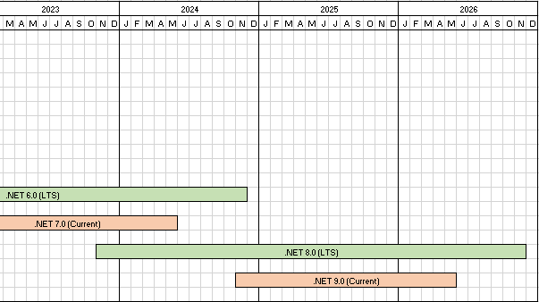
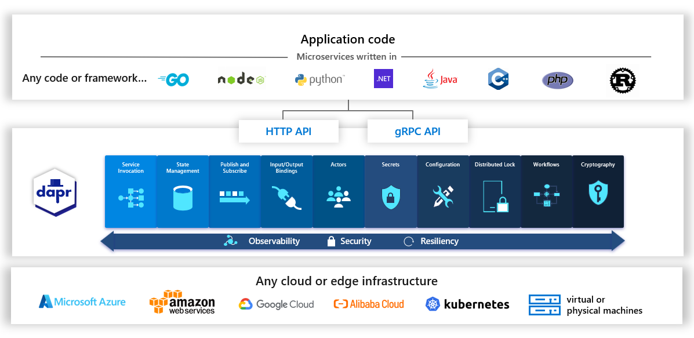
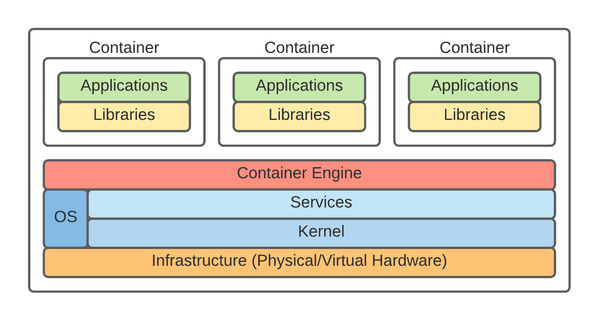
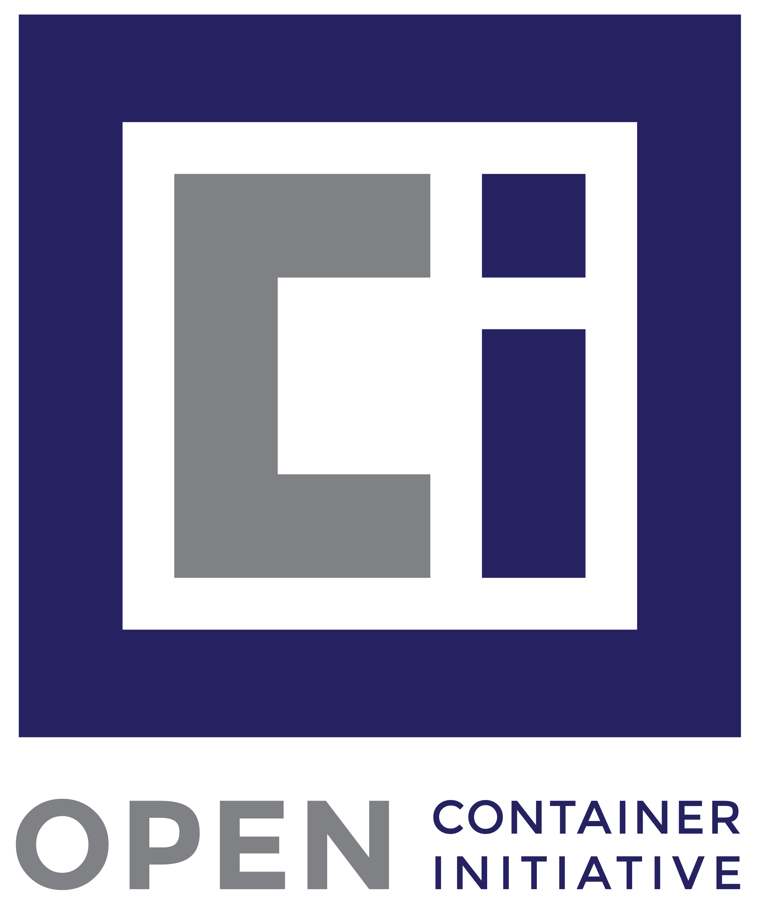
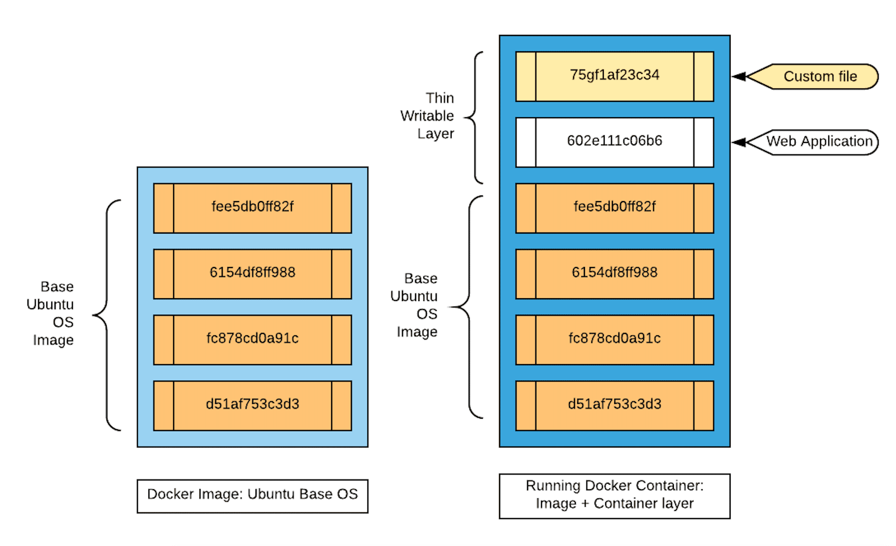
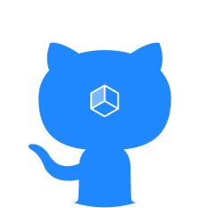
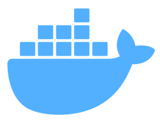
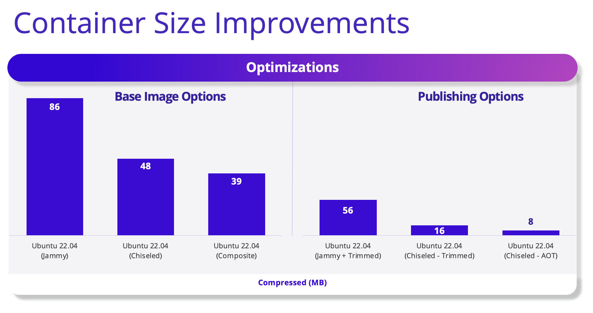
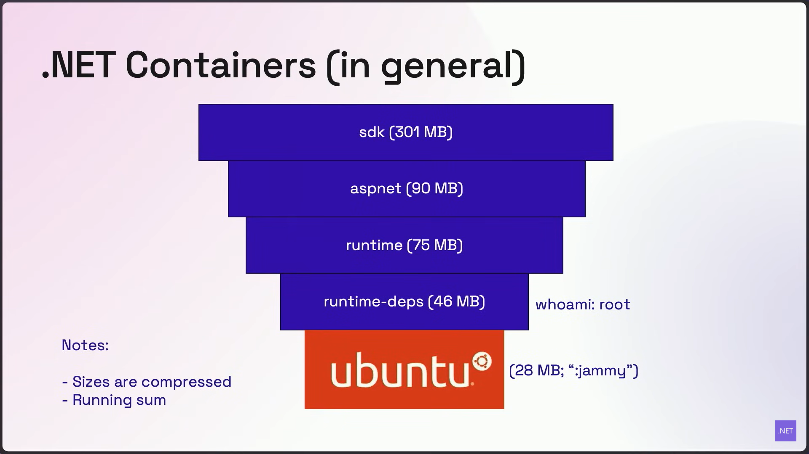
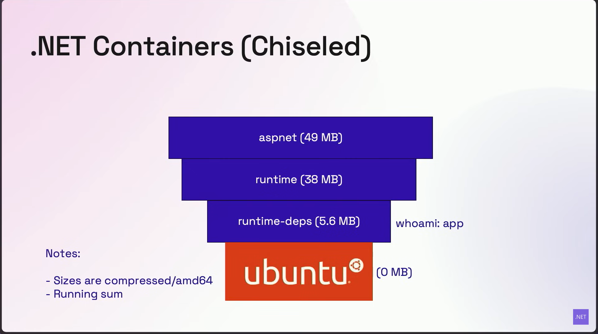

# <!--fit-->Containerizing <i class="fas fa-box"></i><br/>.NET Applications
## Chris Ayers


---


# Chris Ayers
## Senior Customer Engineer<br>Microsoft

<i class="fa-brands fa-twitter"></i> Twitter : @Chris\_L\_Ayers
<i class="fa-brands fa-mastodon"></i> Mastodon: @Chrisayers@hachyderm.io
<i class="fa-brands fa-linkedin"></i> LinkedIn: [chris\-l\-ayers](https://linkedin.com/in/chris-l-ayers/)
<i class="fa fa-window-maximize"></i> Blog: [https://chris-ayers\.com/](https://chris-ayers.com/)
<i class="fa-brands fa-github"></i> GitHub: [Codebytes](https://github.com/codebytes)

---

# Agenda

1. **Software and Architecture**
2. **Containerization**
3. **.NET and Containers**
4. **Configuration**
5. **Security**
6. **Demos**
7. **Questions**

---

# Software and Architecture

---

# Microservices
- Architectural style that structures an application as a collection of loosely coupled services. 
- Improved modularity
- Applications are easier to develop, test, deploy, and scale.
- Each service can be deployed independently, enabling faster iterations.

---

# Cloud-Native Applications

- Applications designed to capitalize on cloud computing frameworks.
- Built and run in cloud environments.
- Emphasize automation, scalability, and manageability.
- Rely on containerization for deployment.

---

# Build and Deployment Patterns 
- Rapid provisioning and scaling.
- Uniform development environments.
- Seamless compatibility with cloud services.
- Observability and monitoring.

---

# Make sure your application is ready for containers

<div class="columns">
<div>

- Understand Dependencies
  - File Access
  - Authentication
  - Logging
  - OS Dependent components
  - Versions
</div>
<div>

- State Management
  - Session State
  - Caching
  - Database
  - File system
</div>
</div>

---

# .NET Version Support


---

# .NET Version Support - Zoomed


---

# Azure Migrate application and code assessment for .NET
## AppCat

- Available as a VS extension or cli tool
- Assesses your application for 
- Detects issues and provides recommendations
- Provides a detailed report

---

# DAPR - Distributed Application Runtime

Dapr provides integrated APIs for communication, state, and workflow. Dapr leverages industry best practices for security, resiliency, and observability, so you can focus on your code.



---

# Containerization

---

# Containers vs. Virtual Machines (VMs)

<div class="columns">
<div>

Container                            
  
- Lightweight images (MBs)             
- Fast (seconds to start)              
- Shared OS can pose security concerns 
- Efficient resource utilization       

</div>

<div>

Virtual Machines (VMs)

 
- Larger images (GBs)          
- Slow (OS needs full init)    
- Superior isolation           
- Higher resource use          


</div>

</div>

---

# Let's define a few Container Terms

---

# Open Container Initiative (OCI)



- A project under the Linux Foundation aiming to create open standards for container formats and runtime. 
- It promotes interoperability and compatibility across different tools and platforms.

---

# Container Images



Container images bundle application code with the necessary runtime, libraries, and configurations. They utilize a **Layered File System** for efficient storage and distribution:
- **Immutable Layers**: Each layer is fixed once created, ensuring consistency.
- **Reusability**: Shared layers across images reduce storage and speed up deployments.
  
---

# Exploring Image Layers
- **Efficiency Through Layering**: Image layers maximize reusability and minimize storage requirements by sharing common layers between images.


---

# Image Tags: Stable vs Unique

- Use semantic versioning or specific build identifiers.
- Maintain clear and consistent tagging conventions for easy tracking.

> | Stable Tags | Unique Tags    |
> |-------------|----------------|
> | latest      | sha256:1234567890 |
> | stable      | build-1234     |
> | v1.0        | 2022-01-01     |
> | production  | 1.0.2         |

---

# Container Registries

<div class="columns">
<div>

Central hubs for storing, managing, and distributing container images, featuring:
- Version and access control for secure collaboration.
- Security scanning to detect vulnerabilities.
- CI/CD integration for automated deployment workflows.

</div>
<div class="center">

<br/>




</div>
</div>

---

# Container Runtimes

<div class="columns">
<div>

Container runtimes are the engines that run containers and manage their lifecycles, with different levels of abstraction:
- High-Level Runtimes: Offer ease of use and extended features for developers.
- Low-Level Runtimes: Focus on performance and fundamental container operations.

</div>
<div class="center">

<br/>
<br/>
<br/>


</div>
</div>

---

# How its all Connected

<br/>


---

# Container Patterns Support a Self-Healing Model


---

# .NET and Containers

- **Portability**
- **Consistency**
- **Scalability**
- **Isolation**
- **Security**
- **Resource Efficiency**

---

# Official .NET Container Images

Microsoft provides official .NET container images for various scenarios, including:

- **Development**: .NET SDK images for building and testing applications.
  - dotnet/sdk: .NET SDK
- **Runtime**: .NET Runtime images for running applications.
  - dotnet/aspnet: ASP.NET Core Runtime
  - dotnet/runtime: .NET Runtime
  - dotnet/runtime-deps: .NET Runtime Dependencies

--- 

# Dockerfiles

- **Basics**: Dockerfiles define the steps to create a container image for applications.
- **Structure**: Includes base image selection, copying application files, and setting up entry points.
- **Customization**: Tailoring Dockerfiles for specific application requirements.


---

# Build & Security Best Practices 
- **.dockerignore**: Exclude non-essential files to speed up builds and enhance security.
- **Multi-Stage Builds**: Separate build and output stages to reduce image size and include only necessary files.
- **Image Optimization**:
  - Use minimal base images and avoid unnecessary packages.
  - Leverage caching for faster builds.
  - Regularly update base images to patch vulnerabilities.
  - Scan images for security issues.

---

# Dockerfile

```dockerfile
FROM mcr.microsoft.com/dotnet/sdk:8.0 AS build-env
WORKDIR /App

# Copy everything
COPY . ./
# Restore as distinct layers
RUN dotnet restore
# Build and publish a release
RUN dotnet publish -c Release -o out

# Build runtime image
FROM mcr.microsoft.com/dotnet/aspnet:8.0
WORKDIR /App
COPY --from=build-env /App/out .
ENTRYPOINT ["dotnet", "DotNet.Docker.dll"]
```

---

# .NET Containers Without Dockerfiles

- **Simplicity**: The `dotnet` CLI enables building and publishing containers directly to a registry.
- **Direct Publish**: Specify your target registry and repository in the project file or command line.
- **Example**: Publish a .NET app as a container using the `-p:PublishContainer` option.
- Options

---
# Azure Developer CLI (azd)

- `azd init` accelerates containerization for .NET apps, preparing them for Azure deployment.
- Generates Dockerfiles and Azure resources automatically.
- Supports Azure Container Apps (ACA) and Azure Kubernetes Service (AKS) deployment.
- Simplifies setup and abstracts Docker/Kubernetes complexities for rapid Azure deployment.

---

## .NET Aspire Overview

- Provides an opinionated framework for building observable, distributed .NET applications ready for the cloud.
- Offers a suite of NuGet packages for common cloud-native application needs.
- Facilitates the development of microservices and distributed apps with seamless service integration.

---

# DEMOS

---

# Ideal .NET Container Images
> Microsoft has been providing .NET Container images for almost 10 years.
> Consistent Themes
- **Small** (faster registry pulls)
- **Secure** (non-root by default, no shell or tools)
- **Compliant** (minimal dependencies)
- **Composable** (add localizations, etc. as needed)
- **Compatible** (glibc vs musl libc)
- **Supported** (long-term support)

---



---



---



---

# DEMOS

---

# Configuration

---

#  .NET Configuration


---

## Environment Variables
Externalize app settings for easy updates without image rebuilds.
- Define variables in deployment manifests or service configurations.
- Simplify configuration management.
- Enhance application portability across environments.

---

# Docker Compose

```docker
catalog-api:
    image: eshop/catalog-api
    environment:
      - ConnectionString=Server=sqldata;Initial Catalog=CatalogData;User Id=sa;Password=[PLACEHOLDER]
    expose:
      - "80"
    ports:
      - "5101:80"
```

---

# Kubernetes Manifest

```yaml
spec:
  template:
    spec:
      containers:
      - name: sampleapi
        image: codebytes/sampleapi:1.0.1
        env:
          - name: "ASPNETCORE_ENVIRONMENT"
            value: "Production"
          - name: "ASPNETCORE_FORWARDEDHEADERS_ENABLED"
            value: "true"
```

---

## Azure App Configuration Integration
- **Centralized Management**: Store all application settings and feature flags.
- **Dynamic Updates**: Refresh settings without redeploying or restarting applications.
- **Security**: Leverage Managed Identities for secure access without credentials in code.

---

# Securely Managing Secrets
### CSI Secret Store & Azure KeyVault

---

## Azure Key Vault for Sensitive Data
- **Secure Storage**: Keep application secrets, keys, and certificates in a secure vault.
- **Integration**: Easily integrate with .NET applications using the Azure SDK.
- **Access Control**: Fine-grained permissions for secure access management.

---

## CSI Secret Store & .NET Integration
- Securely store and manage secrets for .NET applications in Kubernetes.
- **Features**:
  - Automates secret injection into .NET containers at runtime.
  - Leverages Kubernetes' native capabilities for enhanced security.
  - Simplifies secret management.
  - Ensures sensitive data is securely handled and easily accessible to authorized containers only.

---

# Security

---

# Container Scanning in .NET
## Ensuring Security and Compliance

Identify security vulnerabilities and compliance issues in container images.
- **Tools and Practices**:
  - Utilize tools like Qualys, Synk, Trivy, or Docker Scan.
  - Regularly scan images during development and before deployment.
  
---

# Container Security: Root vs. Non-Root Users

---

## Running Containers as Root
- **Default Behavior**: Many containers run as root by default for ease of use.
- **Risks**:
  - Increased attack surface if the container is compromised.
  - Potential for escalated privileges on the host system.
- **Security Practices**:
  - Minimize use of root privileges.
  - Implement least privilege principles for container processes.

---

## Use Non-Root Users
- **Enhanced Security**: Running as a non-root user reduces risks of privilege escalation.
- **Benefits**:
  - Limits the impact of a security breach within the container.
  - Complies with security best practices and regulatory requirements.
- **Limitations**: 
  - May require additional configuration for certain applications.

---

# Demos

---

# Questions?


---

<div class="columns">
<div>

## Resources

#### GitHub Repo
[**https://github.com/codebytes/containerizing-dotnet**](https://github.com/codebytes/containerizing-dotnet)


</div>

<div>

## Contact

<i class="fa-brands fa-twitter"></i> Twitter: @Chris\_L\_Ayers
<i class="fa-brands fa-mastodon"></i> Mastodon: @Chrisayers@hachyderm.io
<i class="fa-brands fa-linkedin"></i> LinkedIn: - [chris\-l\-ayers](https://linkedin.com/in/chris-l-ayers/)
<i class="fa fa-window-maximize"></i> Blog: [https://chris-ayers\.com/](https://chris-ayers.com/)
<i class="fa-brands fa-github"></i> GitHub: [Codebytes](https://github.com/codebytes)

</div>
</div>
